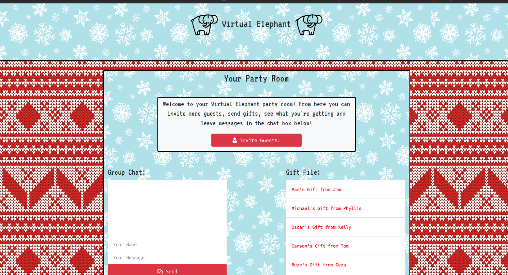
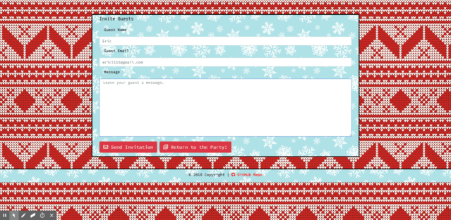
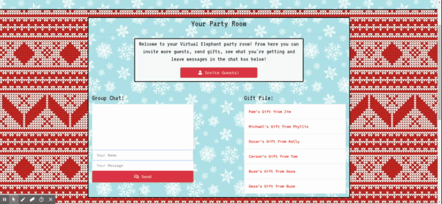
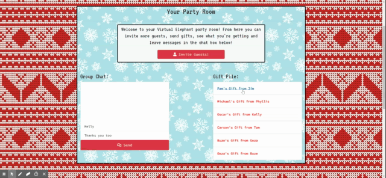

<h1>

</h1>

<h1 align="center">Introducing the Virtual Elephant Gift Exchange!!!</h1>
<h1 align="center">The online way to swap gifts when you can't be together.</h1> 

 

<h2>Virtual Elephant Gift Exchange is an online gift sharing application made for times when you can't get together.  It allows users to recreate the excitement of gift giving even when circumstances mean that they can't be there to give their present in person.  Allows user to trade gifts on their schedule regardless of distance or holidays delivery delays.  </h2> 

## *Give it a try on Heroku* 

  
## Technologies used
- Node.js
- MySQL
- Handlebars - http://handlebarsjs.com/
- express NPM Package - https://www.npmjs.com/package/express
- mysql NPM Package - https://www.npmjs.com/package/mysql
- sequelize NPM Package - https://www.npmjs.com/package/sequelize
- express-handlbars NPM Package - https://www.npmjs.com/package/express-handlebars
- SendGrid API - https://sendgrid.com/
- Socket.io NPM Package - https://socket.io/
  

<h1 align="center"> Contributors: </h1>

<h2 align="center">Carson Curry * Thomas Fricke * Nathan Heseman * Gezahegn Worku</h2> 
 
<h1 align="center"> Screenshots </h1>
 

 

 

